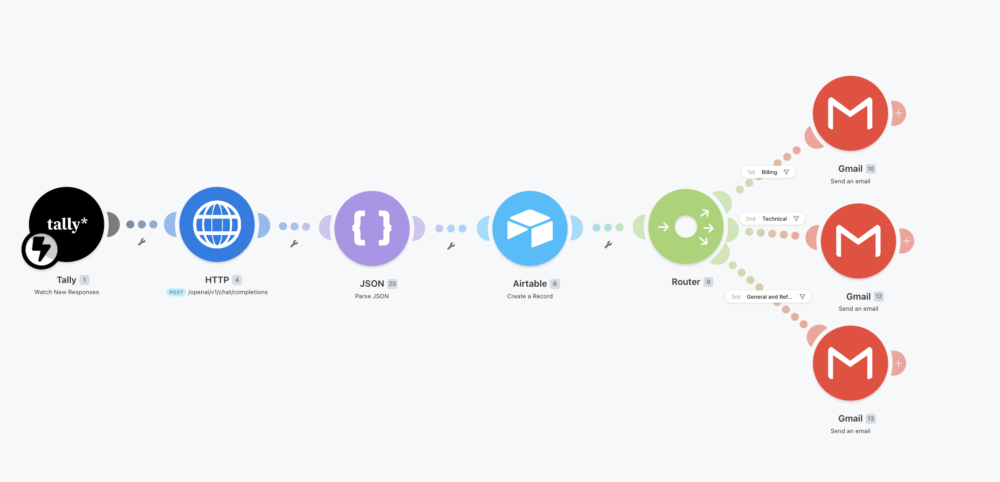
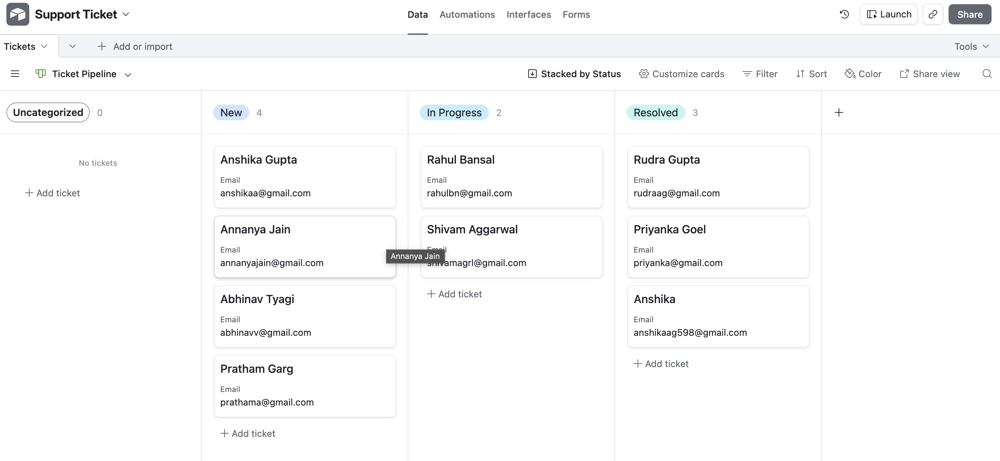
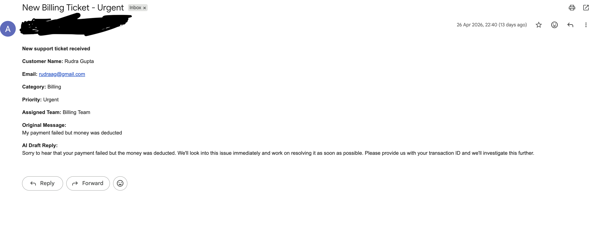

AI Customer Support Triage System

An end-to-end automated support ticket pipeline built on Make.com that processes every incoming ticket from submission to resolution with zero manual intervention in seconds.

---

## What it does

When a customer submits a support ticket:
1. AI instantly classifies it by category, priority and team
2. A professional draft reply is generated automatically
3. Everything is logged in Airtable with 9 fields auto-populated
4. The correct team is notified via email with full ticket details
5. When the ticket is marked Resolved — customer automatically receives a confirmation email

No manual reading, sorting, or routing. Ever.

---

## Demo

### Make.com workflow

### Airtable ticket pipeline (Kanban view)

### Team email notification sample

---

## Architecture

Tally Form → Make.com Webhook → Groq API (llama-3.3-70b-versatile) → JSON Parse → Airtable (9 fields auto-filled) → Router
- Billing → Billing Team email
- Technical → Tech Team email
- General / Refund → Customer Success email

---

## Tech stack

| Layer | Tool |
|---|---|
| Ticket intake | Tally |
| Automation | Make.com |
| AI classification | Groq API (llama-3.3-70b-versatile) |
| Data parsing | Make.com JSON Parse module |
| Database | Airtable |
| Email delivery | Gmail |
| Routing logic | Make.com Router module |

---

## Airtable structure

9 auto-populated fields: Customer Name, Email, Original Message, Category, Priority, Assigned Team, AI Draft Reply, Status, Submission Time

3 views: Tickets (grid), By Category (grouped), Ticket Pipeline (Kanban: New → In Progress → Resolved)

---

## Results

- Ticket handling time reduced from 3-5 minutes to seconds
- 100% of tickets classified, prioritized, assigned and draft-replied automatically
- 3 routing paths ensure the right team gets the right ticket
- Zero manual triage required

---

## How to run this yourself

1. Create a Tally form with 3 fields: Name, Email, Issue Description
2. Create an Airtable base with the 9 fields listed above
3. Import scenario-triage.json blueprint into Make.com
4. Add your credentials: Groq API key, Airtable API key, Gmail OAuth
5. Connect the Tally webhook and activate the scenario

---

## What I learned

- Prompt engineering for reliable structured JSON output from LLMs
- Make.com Router module for conditional multi-path workflows
- Airtable Kanban views for operational ticket management
- Debugging module reference errors and OAuth scope issues
- Switching LLM providers mid-build without breaking the pipeline

---

## Author

Built by Anshika Gupta · https://www.linkedin.com/in/anshika-gupta1008/ · https://github.com/AnshikaGupta0124
